It's February and high time for a new big update for
[CodeSandbox](https://codesandbox.io)! We've been very quiet the past month, but
we were not sitting still. This update is **packed** with new features, I
believe this is the biggest update to date, by far. And the best part is that
many contributors helped with this update!

We have more than 20 new features, a redesign and a rewrite to show, so we
better get started!

## New Editor Design

As time passed by our UI became more and more cluttered. We lost simplicity for
feature abundance and oftentimes it was hard to navigate and find the right
button. We absolutely don't want this and used this as an excuse to go on a
spiritual trip and redesign the editor 👨‍🎨. Again,
[like the homepage](/post/announcing-codesandbox-2-0#new-homepage), we received
a lot of help from [Danny Ruchtie](https://twitter.com/druchtie), props to him!

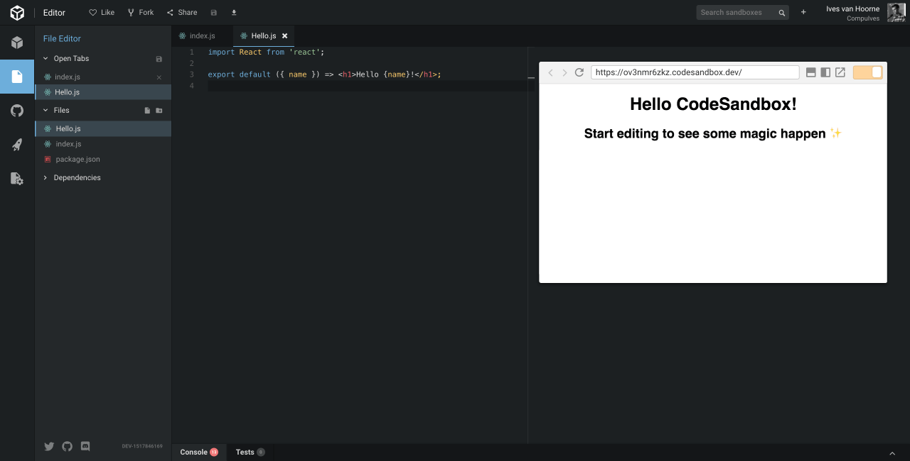

#### Sidebar

A big improvement against the clutter is our new sidebar, inspired by
[Visual Studio Code](https://github.com/Microsoft/vscode). We now categorize all
functionality under their function: 'Project Info', 'File Explorer',
'Deployment', 'GitHub' and 'Configuration Files'. The sidebar is only enabled
when you're looking at your own sandbox.

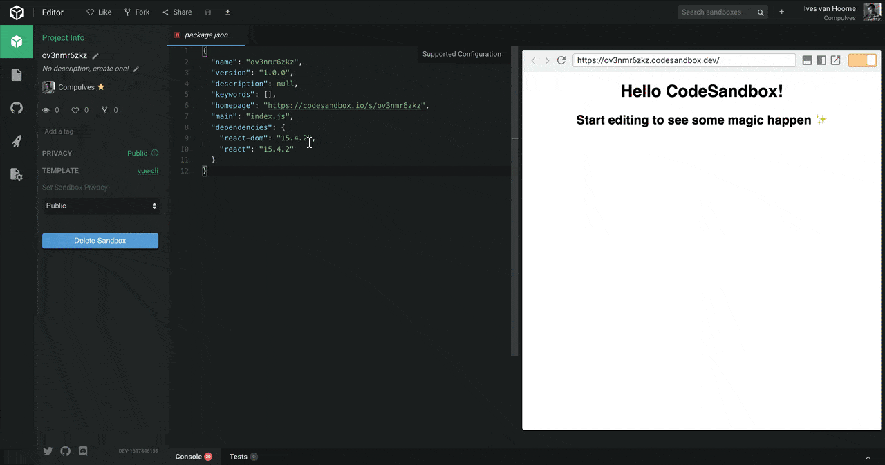

#### Edit/View Mode

We noticed that a lot of functionality was only really useful when you were
editing your own sandbox. That's why we decided to have a separate 'View Mode'.
This mode only shows the sandbox info, the files and the dependencies.

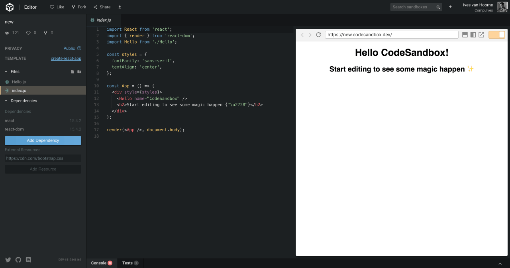

#### Floating Preview

We've upgraded the preview by making it float! You can use the preview now as a
window: you can resize and drag it anywhere. This makes it easier to do mobile
development: you can resize the preview window to a phone size. This also allows
for vertical split between code and preview.

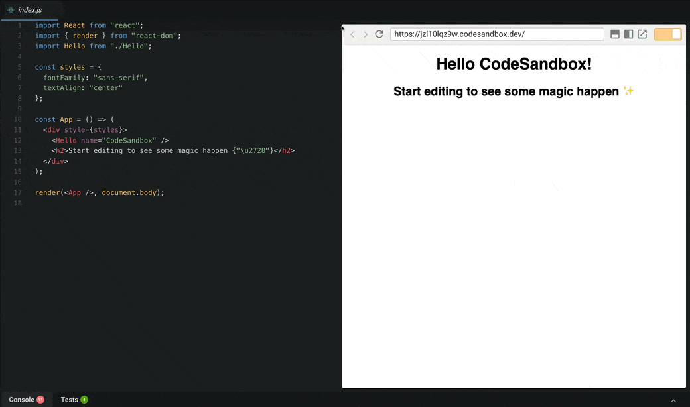

#### Console Upgrades

Our console input received a big upgrade thanks to the work of
[Xiaoyi Chen](https://twitter.com/chxy) (also the author of
[`react-inspector`](https://github.com/storybookjs/react-inspector)). You can
write multiline commands and now we also syntax highlight and autocomplete your
inputs!

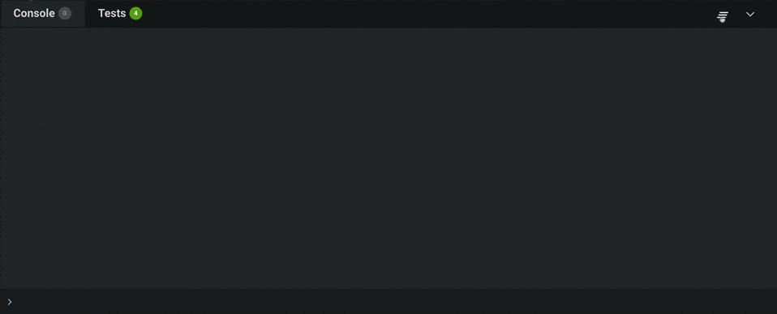

## Rewrite to Cerebral

When we released CodeSandbox I got in touch with
[Christian Alfoni](https://twitter.com/christianalfoni), the author of
[Cerebral](https://github.com/cerebral/cerebral) and
[WebpackBin](https://github.com/cerebral/webpackbin). We started working
together on many different projects, and eventually started toying with the idea
of converting CodeSandbox from [Redux](https://github.com/reduxjs/redux) to
Cerebral. Christian started working on this about three months ago, and it's
finished now!

We now use Cerebral for state management, backed by
[`mobx-state-tree`](https://github.com/mobxjs/mobx-state-tree). This gives us
the declarative functional composition of the CodeSandbox application logic and
typed observable state values for optimal rendering out of the box. It has
resulted in more performance and a reaaaally nice debug view!

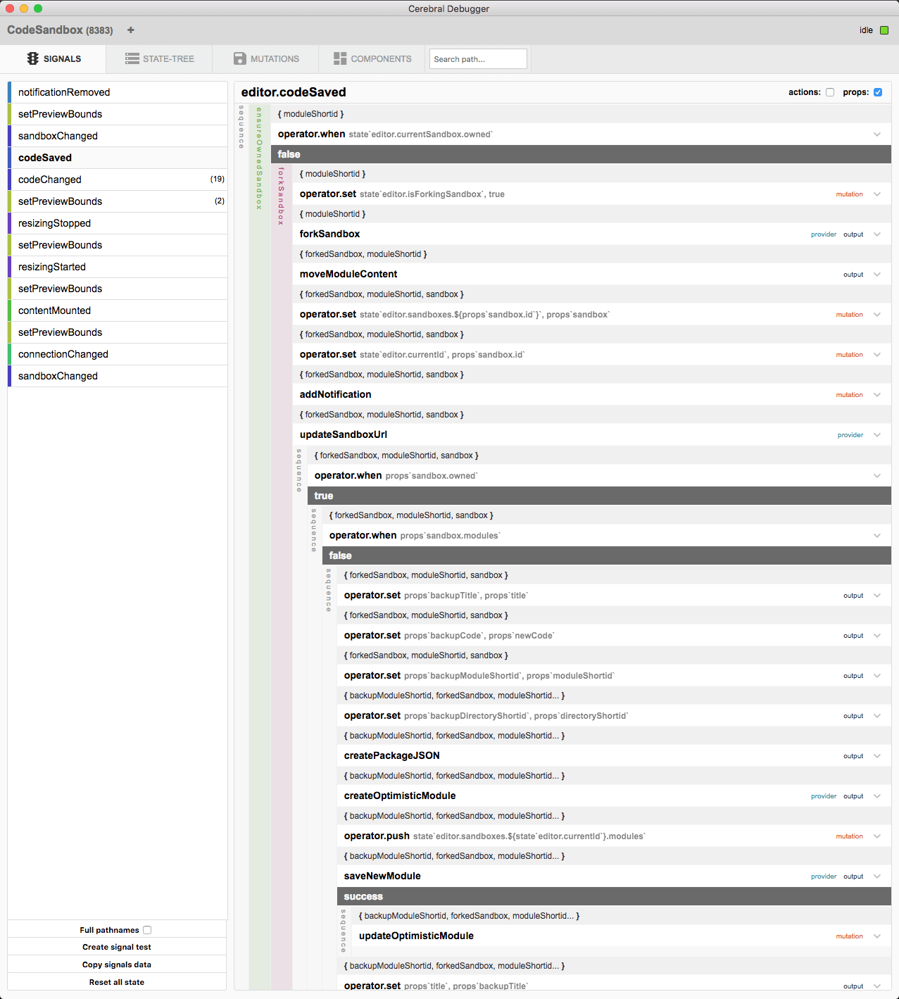

During the rewrite we also took the opportunity to implement several new
optimistic updates for a smoother user experience.

You can read more about the complete rewrite
[here](https://medium.com/@christianalfoni/lessons-learned-refactoring-codesandbox-io-from-redux-to-cerebral-40e9a5646281).

## Configuration Support

Our stance on configuration is quite simple;
[configuration means that the program is too stupid to determine what the user wants](https://fishshell.com/docs/current/design.html#design-configurability).
Oftentimes you can satisfy 90% of the user preferences without configuration.

However, there is still the other 10%, CodeSandbox as an application is a good
example of this. That's why we are introducing official support for
configuration files. Depending on the template, you can configure several
aspects of your sandbox. The configurations we currently support are:
`package.json`, `.prettierrc`, `.babelrc`, `sandbox.config.json` and
`.angular-cli.json`.

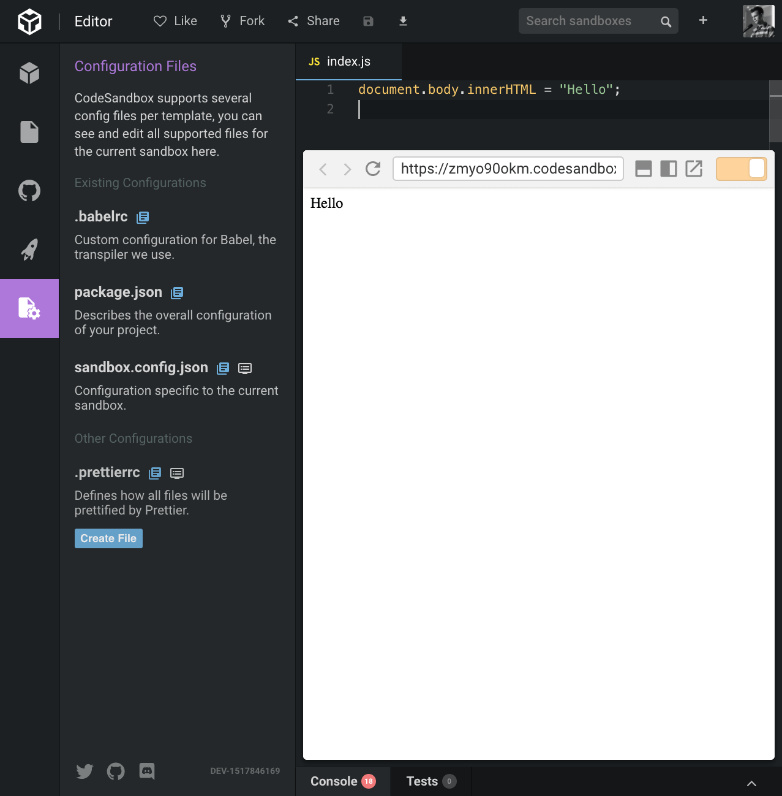

#### Single Source of Truth

We previously saved dependencies, titles, etc. separately in our database. When
you'd import a sandbox from [GitHub](https://github.com) we would get every
relevant field from the files and save them manually in our database. This
creates friction: when you add a dependency we need to manually update the
database **and** update `package.json`.

From this update on we make the files our
[source of truth](https://en.wikipedia.org/wiki/Single_source_of_truth) for
almost all data, this means that sandbox data is parsed from `package.json` and
other relevant configuration files live in the editor. We add this
retroactively; when you open a sandbox we automatically generate a
`package.json` if it doesn't exist.

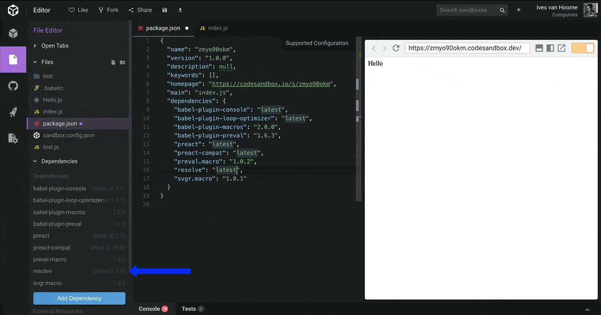

#### Configuration UI

We are of the opinion that UI can be far more intuitive than code. That's why we
aim to _interfacivize_ (if that would be a word) all configuration files. We
show a UI which you can use to generate code for the configuration files. We
still allow you to switch to the code, if you want more control 😉. We don't
have a UI for all configurations yet, but we show custom autocompletions for
those configurations.

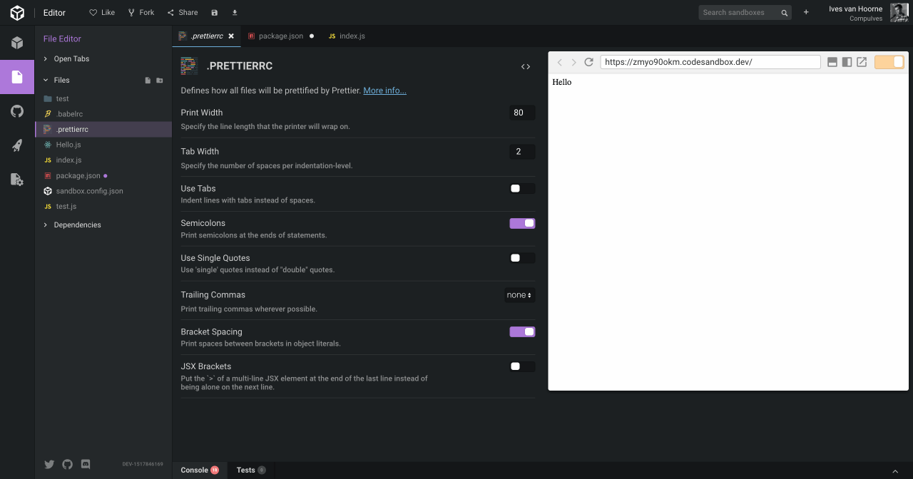

#### Babel Plugin Support

A much requested feature was custom [Babel](https://github.com/babel/babel)
plugins support, not only the official ones, but also community plugins. We now
allow the configuration of `.babelrc` in the
[Preact](https://github.com/preactjs/preact) template and will soon enable this
in [Vue](https://github.com/vuejs/vue) and our upcoming '`Custom`' sandbox. A
cool addition to this is that we support the
[`fs`](https://nodejs.org/api/fs.html#fs_file_system) interface. This is
especially useful for Babel plugins like
[`babel-plugin-preval`](https://github.com/kentcdodds/babel-plugin-preval). Go
ahead and try it!

https://codesandbox.io/s/xp5qy8r93q?fontsize=14&view=split

<!-- Live in action! It's still a bit rough, sometimes you need to hard reload to see changes. -->

Advanced Babel plugins like
[`babel-plugin-macros`](https://github.com/kentcdodds/babel-plugin-macros) that
use `fs` are currently in beta. We will streamline Babel plugin support over the
coming weeks, with a custom UI to search for plugins and the ability to create
and select presets.

#### Sandbox Configuration

You can now configure your sandbox using `sandbox.config.json`. You can find
more documentation about `sandbox.config.json`
[here](https://codesandbox.io/docs/configuration#sandbox-configuration).

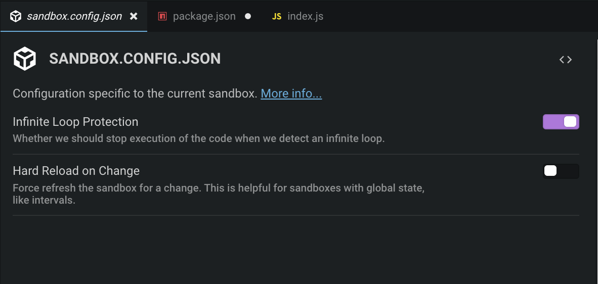

## Angular Template

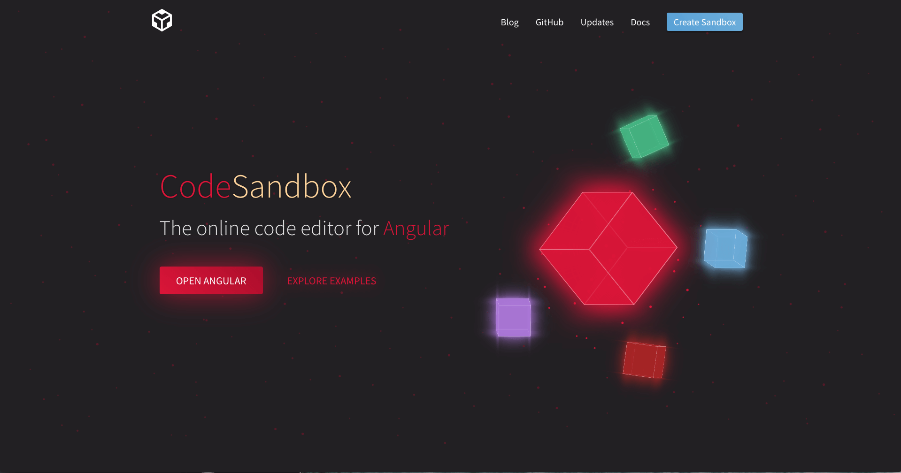

Official [Angular](https://github.com/angular/angular) support was an often
requested feature from day one. We now officially support Angular templates,
including the corresponding `angular-cli.json` file that comes with it!

Give it a try here:

<!-- https://angular.codesandbox.io -->

https://codesandbox.io/s/angular?fontsize=14&view=split

[Or open it in the new editor!](https://codesandbox.io/s/angular)

## Native Jest Support

We now have [Jest](https://github.com/facebook/jest) support, mainly thanks to
[Gautam Arora](https://twitter.com/gautam)! Gautam opened an
[issue](https://github.com/codesandbox/codesandbox-client/issues/364) for Jest
integration about 2 months ago, and about a month later he opened a
[PR](https://github.com/codesandbox/codesandbox-client/pull/445) with a version
that already could run all tests of the
[Redux examples](https://github.com/reduxjs/redux/tree/master/examples).

The past week I've been working a native UI for Jest that fits with our
redesign, and I'm really proud of how it turned out. I took inspiration from
[Majestic](https://github.com/Raathigesh/majestic) and
[Storybook](https://github.com/storybookjs/storybook). Let's see what it looks
like.

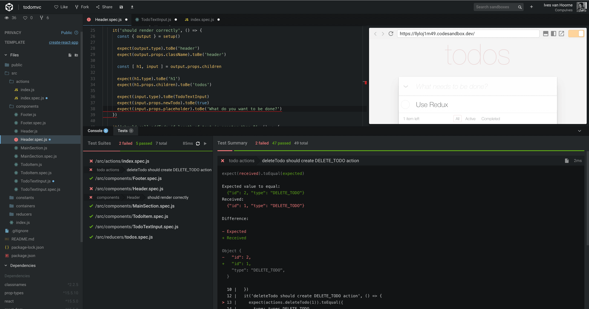

As you can see the files with tests are in the left navigator. When you select a
test file you get the details of that file, including statuses and eventual
errors.

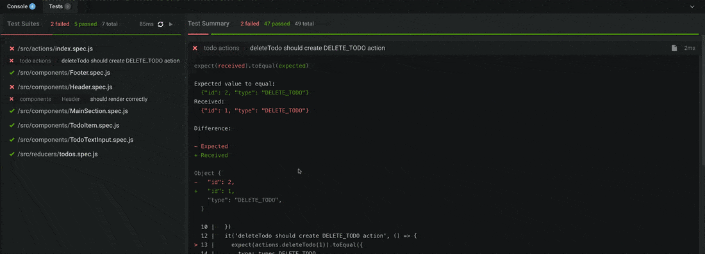

We automatically watch all test files. If you change a file we will only rerun
the tests that require this file, either directly or indirectly. We also support
[snapshot testing](https://jestjs.io/docs/en/snapshot-testing), though we're
still working on the possibility to save new snapshots.

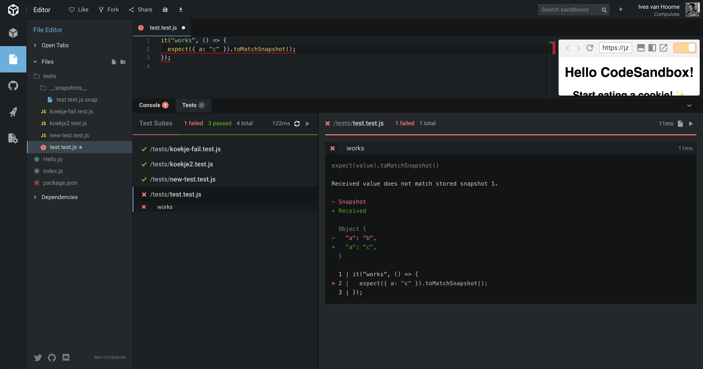

I'm really proud of the integration with Jest, and it was only possible because
the Jest team did an **incredible** job by
[publishing all their functionality in separate packages](https://jestjs.io/docs/en/jest-platform.html).
We just cherry picked the packages that we needed to make Jest work in the
CodeSandbox!
[The Redux TodoMVC example](http://codesandbox.io/s/github/reduxjs/redux/tree/master/examples/todomvc)
is a good sandbox to play with Jest support.

> Note that this is not fully native Jest, we don't support writing snapshots,
> manual mocks using the `__mocks__` directory and Jest configuration yet. We
> will add this soon though.

## CodeSandbox Bundler Upgrade

I did some upgrades to the bundler of CodeSandbox, the most notable improvements
are caching and an official HMR API.

#### Compiler Cache

After every successful bundle we cache all relevant
[transpilation](https://en.wikipedia.org/wiki/Source-to-source_compiler) and
files in
[IndexedDB](https://developer.mozilla.org/en-US/docs/Web/API/IndexedDB_API).
When you refresh the sandbox you only need to actually evaluate all the files
instead of doing transpilation etc. This results in very fast initial load
times, as you can see in this GIF.

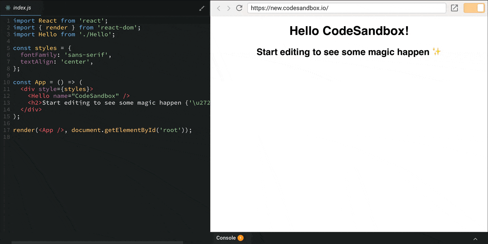

#### Hot Module Reloading API

We also now have official HMR support (finally!). You can use the `module.hot`
API like in [`webpack`](https://github.com/webpack/webpack), this is useful for
when you want to preserve state between runs for example. We also added official
support for the HMR API in our Vue loader, this means that Vue gets proper HMR
out of the box!

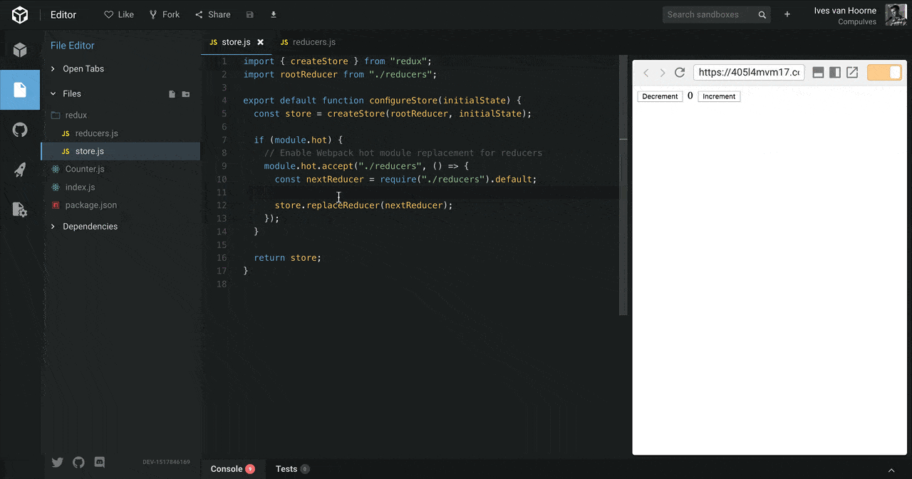

https://codesandbox.io/s/rw6k1nkxj4?fontsize=14&view=split

<!-- Vue Example: edit the template or the styles and see that the state doesn't change -->

## Updates You Might Have Missed

We've had many updates recently. Here's a quick recap of some changes that
happened in December:

#### Zen Mode

Zen mode hides all distracting elements, therefore it's perfect for
presentations and course videos. You can enable it in preferences or by the
keybinding.

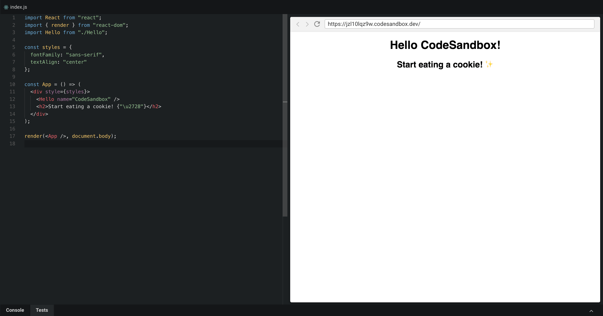

#### Keybinding Support

You can now set up custom key bindings for actions in CodeSandbox!

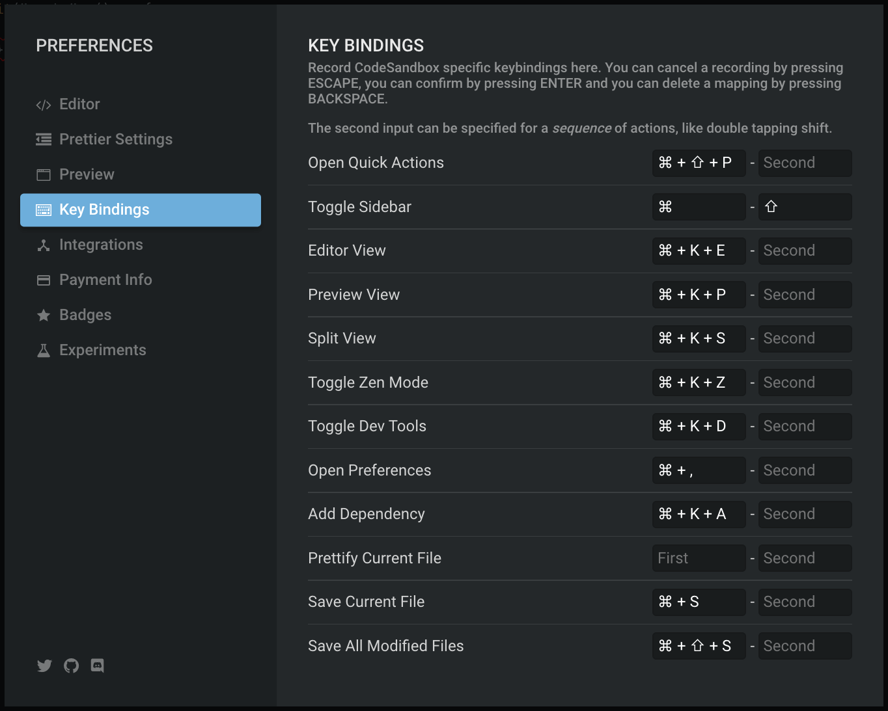

#### Quick Actions

Quick Actions can be activated with (CMD/CTRL)-Shift-P and will show this as
popup.

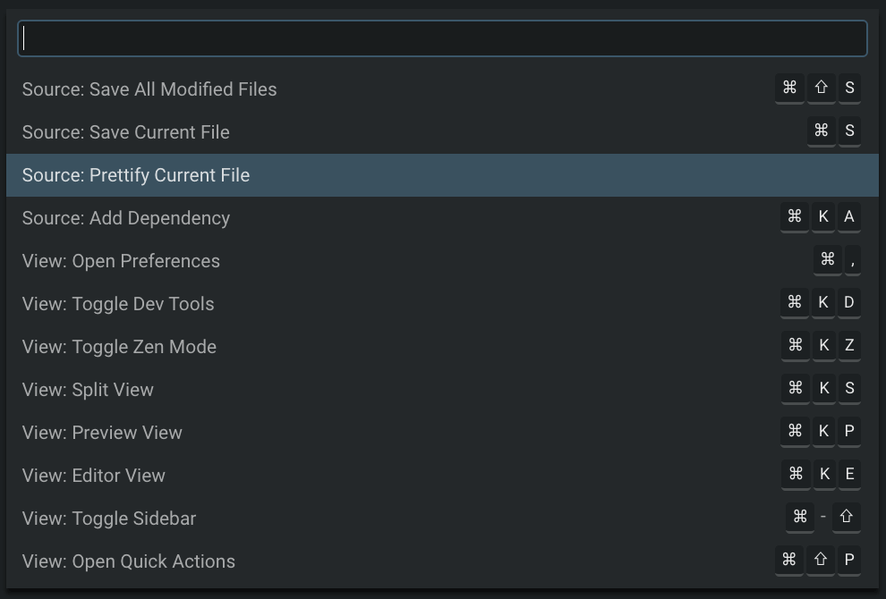

It allows you to quickly active actions without touching your mouse or
remembering a key binding.

#### CodeSandbox Documentation

To answer questions or explain CodeSandbox concepts we now have an
[official documentation](https://codesandbox.io/docs).

You can follow either [CodeSandbox](https://twitter.com/codesandbox) or
[me](https://twitter.com/CompuIves) on Twitter to keep up to date with any
changes. We also keep a changelog [here](https://codesandbox.io/changelog).

## What's Next

Oh well, that was a big list of changes... The coming week I will concentrate
mostly on my talk at [Vue Amsterdam](http://vuejs.amsterdam) and fixing any bug
that may pop up. However, we do have some exciting plans for the coming time!

#### Custom Template

We have support for many transpilers right now, but there is no template that
supports all of them. We've seen that users want to experiment with different
things like Babel plugins, but don't want to tie their sandbox to a template
that's not related to their project. That's why we'll implement something called
a Custom template in the near future. I've already done some work on this
feature and wanted to release it with 2.5, but ran out of time. Bottom line is,
it should be done soon 😃.

#### Hosting Migrations

We have grown a lot since we started. We want to have more scalability, so we
will move our hosting over to [Kubernetes](https://kubernetes.io).

We are also starting a big project that will start this February and will
continue for the coming 3 months. I can't give any details on that project yet
except for saying that it's an exciting change.

## Thanks

This update received a lot of support from contributors of CodeSandbox. I'm
really thankful for all the work from others, and I'd like to especially thank
[Bogdan Luca](https://twitter.com/lucabogdan),
[Christian Alfoni](https://twitter.com/christianalfoni),
[Danny Ruchtie](https://twitter.com/druchtie) and
[Gautam Arora](https://twitter.com/gautam) for their work and support on this
update.

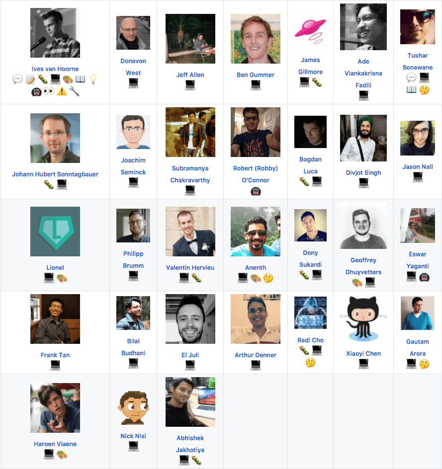

#### Want to get involved?

We're 90% (soon 100%) open source! We welcome any help with open arms. If you're
interested in helping out, I recommend you to check out our
[client repo](https://github.com/codesandbox/codesandbox-client).

If you want to chat, we have an active
[Spectrum community](https://spectrum.chat/codesandbox).

Also, if you would like to support CodeSandbox financially, you can become a
[CodeSandbox Patron](https://codesandbox.io/patron)!
