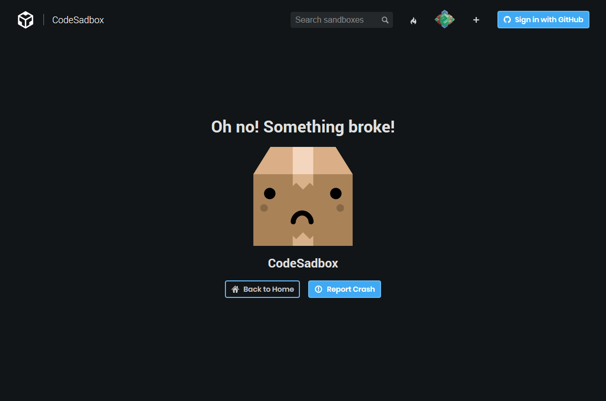
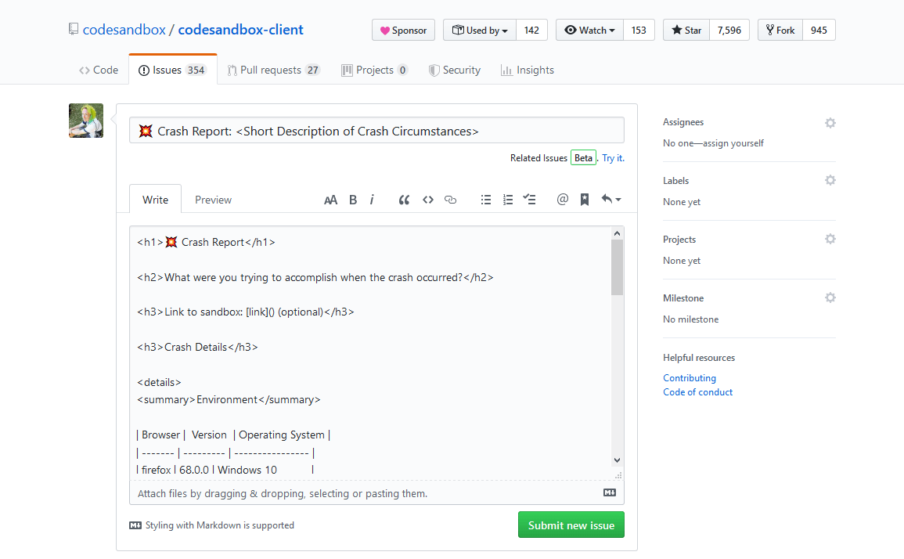
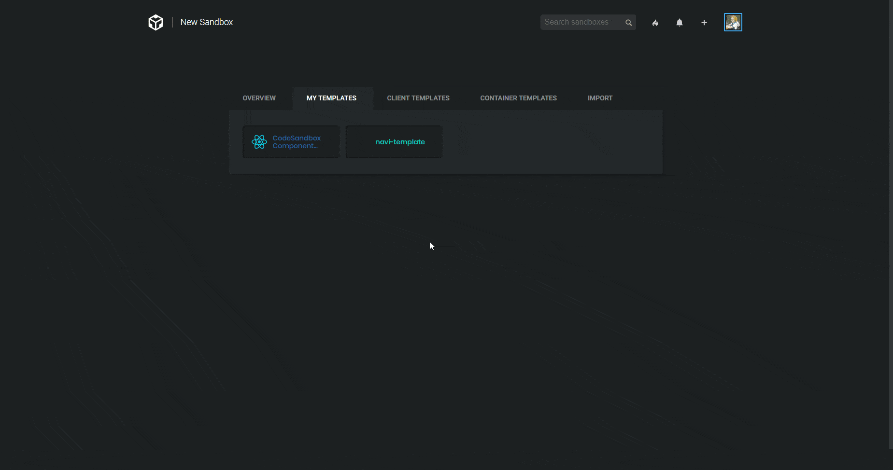
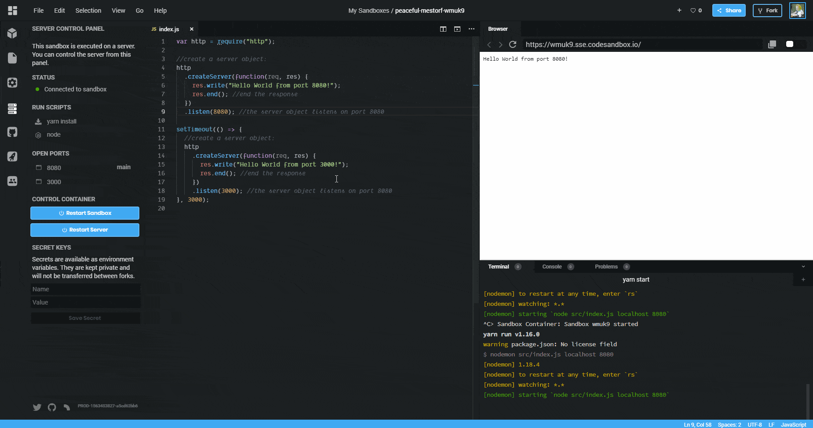

Have you every been using CodeSandbox only to encounter a suddenly blank screen?
We certainly have in development! Often, this occurs when one of our components
encounters an error during render. For our part, we try our best to weed out all
of these cases before shipping new updates to you, but occasionally these sorts
of errors can and do pop up in rare edge cases in our production app.

To make it more obvious that you've entered one of these states, we've
implemented a new Error Boundary component that will display a fallback UI which
we're calling CodeSadbox:

While we hope you'll never encounter this screen, in case you do, we've added a
convenient way for you to help let us know how you got there! By clicking on the
Report Crash button, a new window will open that will take you directly to
GitHub to file a new issue. Best of all, your new issue will be pre-filled with
some useful crash information!

In this initial version, the auto-generated crash report includes information
about your environment, the error message you encountered, and a component stack
trace. We plan to improve this over time to make it even easier to track down
those nasty bugs and get a fix issued asap!

So if you're feeling up for challenge, see if you can find your way to this
elusive little box! We're excited to see what sort of bugs you can find!

## But wait, there's more!

We've actually got a few other goodies to share this week! In our recent release
of [Templates](/post/Templates), you may have noticed that there was something
missing: the ability to add an icon to your new custom template. Well now we've
got a sweet new icon picker that you can access in your Template configuration
inside of the Project Info panel:

Not only that, we've shipped a much requested feature for Containers: multiple
port support! Now when your container beings listening on an additional port,
you'll see a toast notification in the bottom-right corner letting you know and
providing you the option to open a new browser preview tab as well:

With this update you'll be able to run both a web app and an API from a single
container instance with ease. We're excited about all the new projects this will
enable!

Lastly, this week we've been focused on merging some outstanding PRs and fixing
bugs. We're also in the process of re-writing the whole application in
TypeScript and refactoring to use hooks. While not all of this work will be
immediately visible, these efforts are setting the foundation for everything
that is to come!

Thanks for using CodeSandbox and we look forward to sharing more updates with
you soon!
