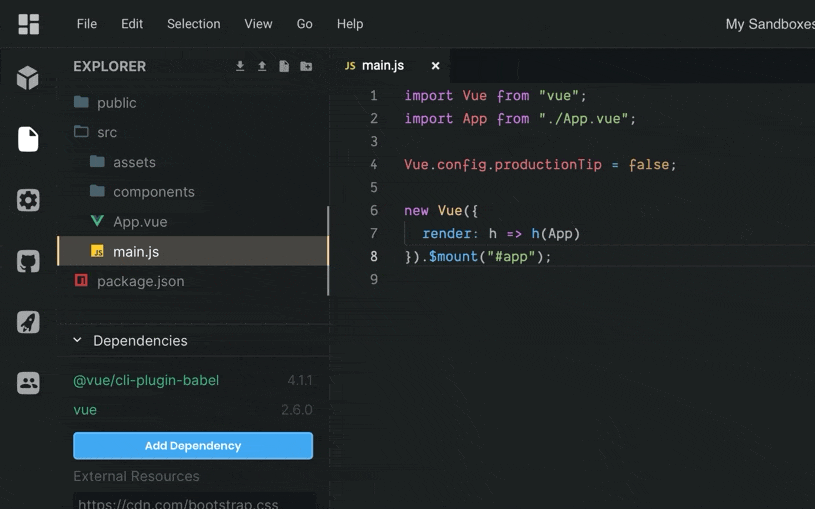

When chatting with folks in the CodeSandbox community, there’s one word that
comes up more than any other: Speed! It’s a core reason why people choose
CodeSandbox for web development—so they can get started prototyping quickly,
testing out ideas, and learning new frameworks and techniques. But it’s also one
of the most frequently requested improvements too. When it comes to web
development, it seems we all have an unrelenting need for speed. But in
software, speed is a nuanced thing. There’s how quick things _are_, and how fast
they _feel_, which is why we’ve been tackling both as part of our snappier, new
look editor.

## From click to coding in half the time

Over the last few months, we’ve been working on a range of performance
optimization tasks. From tweaking database queries and API calls to
re-architecting how we integrate with VS Code. We’ve been incrementally
releasing these improvements and making things faster as we go. Still, some
notable improvements are that average sandbox load and fork times are 1/10th
what they were before, we’ve also made the editor feel more responsive when
opening new files, and you can now work with much larger projects.

One clear change you’ll see today is that the loading screen is gone. We now
progressively load parts of the editor instead of waiting for everything to be
ready upfront. So you can begin editing your project in half the time it took
previously.

## Designed to get you to the code faster

But we haven’t just been tackling the technical challenges; we’ve also refreshed
the design of the editor too. This isn’t some big redesign with changes for
change’s sake. We’ve evolved the look of the editor, so it retains its familiar
feel but gets you to the code faster, and then gets out of your way. To make
this happen, we re-worked the sidebar and top navigation with subtler styling,
clearer icons, refinements to the color palette, as well as a new default theme.

Head of Design at CodeSandbox, Danny Ruchtie, adds that “_although this is a
significant visual refresh, it’s primarily meant to lay the groundwork for
future improvements. The newly designed components system will make it easier
for the team to implement new features, and it adds better support for VS Code
themes too._”

There’s still work to do, both in terms of editor design and performance. For
now, we’ve been running these changes as an experiment over the last few weeks,
incorporating feedback from the community. It’s available for everyone to use
from today, so go ahead and try it out for yourself.

## Thanks

Thanks go to [Sara Viera](https://twitter.com/NikkitaFTW),
[Siddharth Kshetrapal](https://twitter.com/siddharthkp),
[Christian Alfoni](https://twitter.com/christianalfoni), and
[Danny Ruchtie](https://twitter.com/druchtie), whose hard work made this
possible. And also to those of you who have provided considered feedback while
in preview. We’re excited to see what you build next!
