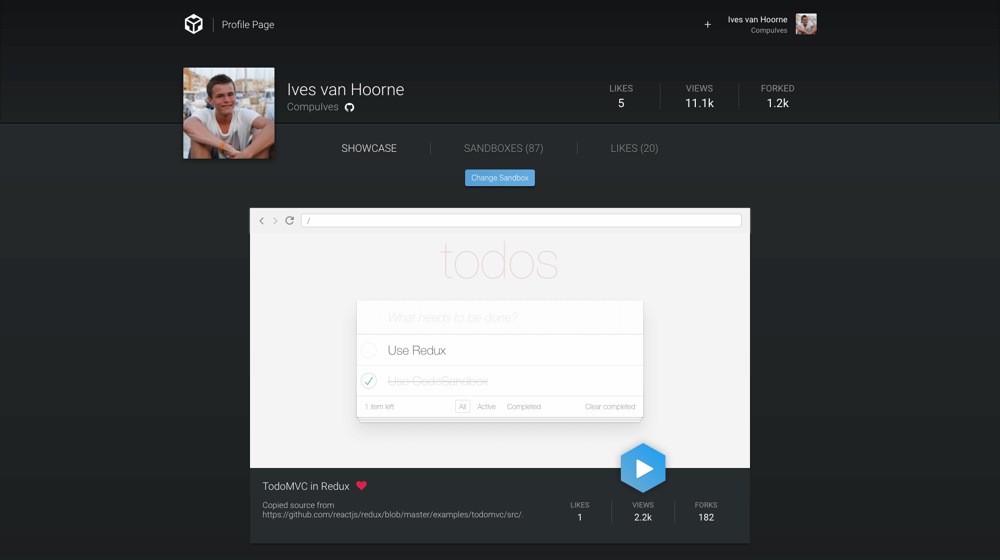
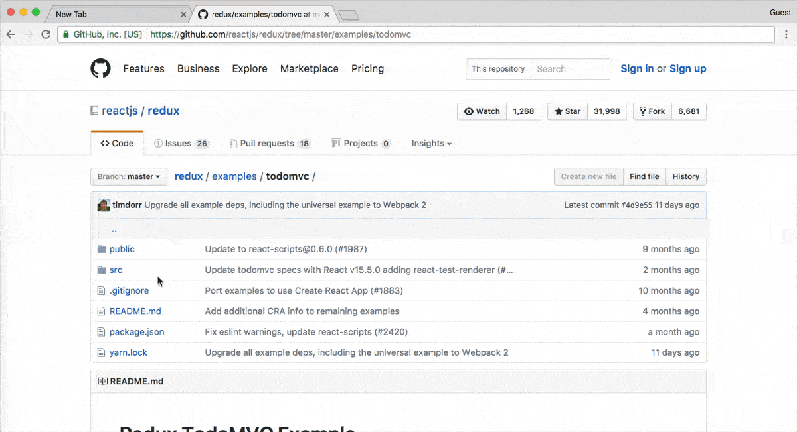
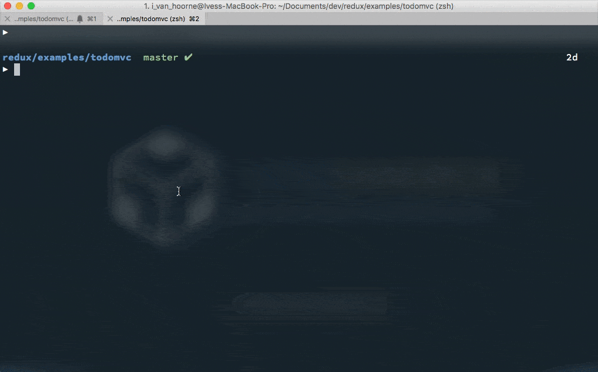

It's already been two months since we 'officially' released
[CodeSandbox](https://codesandbox.stream) with
[this](/post/codesandbox-an-online-react-editor) article. In the article I
started out with sharing some stats, so let's do this again for old times' sake.

CodeSandbox gained a surge of popularity after the last article. Two months ago
we had 1500 sandboxes and 280 users, now we have **16000** sandboxes and
**2300** users! We've been storing 1.3 million new characters of code each day.
I can't state how incredible this is; it has gone above and beyond my
expectations. I'd like to thank everyone for using CodeSandbox and reaching out
to me.

## What has been done

I want to start with a retrospect on what we have built in the last 2,5 months.
We've gained a lot of feedback and thanks to that I was able to build a **lot**
of new functionalities. Here are some highlights of the biggest changes:

#### Profile view

You can now see what others are building on CodeSandbox, every user has a
profile view that shows all their sandboxes. You can also 'like' other sandboxes
and see how many views your sandbox has received.
[BTMPL's profile](https://codesandbox.stream/u/BTMPL) contains some great examples,
and all his sandboxes are nicely tagged.



#### Embeds on Medium

You can share a sandbox on platforms that support [Embedly](https://embed.ly),
like [Medium](https://medium.com). You can even edit the embedded sandboxes on
there, which means that you can do some pretty creative things like a component
tutorial on Medium with interactive examples.

<!-- https://new.codesandbox.stream -->

https://codesandbox.stream/s/new?fontsize=14&view=split

<!-- The 'new' sandbox on Medium, try editing it! -->

#### Improved npm dependency support

After releasing CodeSandbox I got in contact with
[Christian Alfoni](https://twitter.com/christianalfoni), the author of
[WebpackBin](https://github.com/cerebral/webpackbin). Both our services have
[npm](https://npmjs.com) dependency support and we're both challenged with
efficiently handling this. We decided to work together and build a
[common 'packager'](http://webpack-dll-prod.herokuapp.com) for WebpackBin and
CodeSandbox. The new packager is a lot smarter than previous versions and now
supports features like CSS files and browser mappings. We wrote an article about
it,
[which you can find here](https://medium.com/@christianalfoni/webpack-bundling-as-a-service-f902ab1a9f4c).
Thanks a lot to Christian, he did an incredible amount of work on the packager
and it's great working together with him.

## Vision

Dozens of people reached out to us with ideas about CodeSandbox.
[Phil Holden](https://twitter.com/phil_m_holden) also released a
[very interesting article](https://hackernoon.com/javascript-tightening-the-loop-part-1-9771a0de372a)
about the use cases of an online editor like CodeSandbox. It inspired us and we
realized that this tool has a lot more potential than just as a platform to
share your creations. We've set two goals for the future development of
CodeSandbox.

#### 1. Make it so easy that a child can use it

I've received dozens of emails from people who are learning
[React](https://github.com/facebook/react) using CodeSandbox, and this makes a
lot of sense. With a tool like CodeSandbox you don't have to learn how `bash`
works, or what `npm` is, or what '[`node`](https://github.com/nodejs/node)'
stands for. You can just open a web page and start hacking away.

When you're just starting out, you want to immediately get started with the fun
stuff instead of having to learn all these additional technologies first. Of
course you'd need to learn them eventually, but having these obstacles at the
beginning is discouraging when you just want to start building.

I, and I think more of us, suffer from the
[curse of knowledge](https://en.wikipedia.org/wiki/Curse_of_knowledge), it
becomes harder and harder to put ourselves in the position of a beginner as we
know more. Things like the
[terminal](https://en.wikipedia.org/wiki/Computer_terminal) and the editor
become trivial and we forget that we were puzzling for hours over this.

Precisely because of this, we need to set a more ambitious, but relatable, goal:
make web application development so easy that even a child can easily start
learning it.

https://twitter.com/donavon/status/876042853058830336

<!-- A child of 8 played with React using CodeSandbox! -->

I believe that the best way of learning is by trial-and-error. You'll remember
better why you should apply a solution if you've experienced the error
firsthand. This means that when a user makes an error, we need to show the best
directions to a solution.

For CodeSandbox, this means that we need to focus on creating friendlier error
messages and try to offer suggestions when an error occurs (like missing
libraries). Configuration should stay to a minimum, and if we do have
configuration we should offer the option to do this in a GUI.

There are a lot of improvements that can be made to make CodeSandbox a very
user-friendly editor, even more so than other editors since we can assume the
context the user works in. Let's use this to our advantage.

#### 2. Make it a place for easily discoverable examples

Approximately 300 sandboxes are created on a daily basis. These sandboxes are
built for a myriad of different purposes, but most of the time to share with
others. There is no way to find sandboxes built on CodeSandbox, which is a real
shame since we're sitting on a goldmine of valuable information.

Libraries are a great example. There already are awesome libraries like
[`redux-form`](https://github.com/erikras/redux-form),
[`glamorous`](https://github.com/paypal/glamorous),
[`mobx`](https://github.com/mobxjs/mobx),
[`apollo-client`](https://github.com/apollographql/apollo-client),
[`css-constructor`](https://github.com/siddharthkp/css-constructor), and
[`react-day-picker`](https://github.com/gpbl/react-day-picker) that use
CodeSandbox for error reporting and/or documentation. There is really valuable
content written by the authors of these libraries, but we're missing a way to
easily discover these libraries and examples.

There are dozens of sandboxes with lessons about React too. People use sandboxes
to teach others about different concepts, like
[the difference between a](https://codesandbox.stream/s/Wn3zGj3pn)
[`PureComponent`](https://codesandbox.stream/s/Wn3zGj3pn)
[and](https://codesandbox.stream/s/Wn3zGj3pn)
[`Component`](https://codesandbox.stream/s/Wn3zGj3pn), or
[how to do a delayed navigation with](https://codesandbox.stream/s/XoBNWnBWv)
[`react-router`](https://codesandbox.stream/s/XoBNWnBWv). These sandboxes are often
shared on [Reactiflux](https://www.reactiflux.com) or
[Twitter](https://twitter.com), but it would also be great if you could discover
them via CodeSandbox.

We should have an advanced and performant search. This way you can, for example,
easily search for a library and find all sandboxes which use that library.

## New Features

A CodeSandbox post is not a CodeSandbox post without new features! We're
releasing two new features that will make it easier for you to put your projects
on CodeSandbox.

#### Import from GitHub

Importing from [GitHub](https://github.com) was a much requested feature, and
now it's here! The implementation is fairly simple, you can pick a GitHub URL,
replace `github.com` with `codesandbox.stream/s/github` and that path will point to
a sandbox that'll automatically stay up to date with the git repository.

https://codesandbox.stream/s/lOBDPMW7M?autoresize=1&hidenavigation=1&view=preview

For now we only officially support
[`create-react-app`](https://github.com/facebook/create-react-app) projects on
CodeSandbox, this means that it most probably won't work with other projects on
GitHub.



#### CodeSandbox CLI

You can now also upload your `create-react-app` projects using a CLI. Imagine
you are having a problem with your project, now you can easily upload your
project to CodeSandbox and ask others for help. Or if you have a bug report to
make, you can easily upload a reproducible case to CodeSandbox.



The CLI can be installed using either [yarn](https://yarnpkg.com) or npm:

```bash
npm i -g codesandbox
```

To upload your project, you can go to the directory of your project and run
`codesandbox ./`. This will upload the current directory and give you the URL of
the sandbox. The source of the CLI can be found
[here](https://github.com/codesandbox/codesandbox-importers/tree/master/packages/cli).

## What will come

There's a lot on the roadmap for this coming summer. I want to focus a big chunk
of my time in making the editor more user-friendly. We also have a list of
features that are going to be implemented in the coming months. Here's some of
the highlights:

#### Search using Algolia

I'm very excited about this. We're working together with
[Algolia](http://algolia.com) to add search for sandboxes. This will help a lot
with adding discoverability for sandboxes. A concrete example: let's say you
want to know how to use `redux-form`. With the new search, you can search for
all sandboxes using this library. We're hoping to turn CodeSandbox into a
central place for finding React examples. This feature will also allow you to
tag sandboxes.

#### Deploy with Vercel

We're also working together with [Vercel](https://vercel.com) to integrate
deployment with sandboxes. There'll be a 'Deploy with Vercel' which will deploy
a production-ready version of your application using the magic of Vercel. This
is really cool, because now, you'll finally be able to build applications on
CodeSandbox from start to finish. This has already been done before, but the
deploy step was missing. The people at Vercel are incredibly helpful and it's
really great to see that we're sharing the same vision.

#### Static file support

You won't be able to use the `public` folder when uploading using the CLI yet,
because we don't have static file support. This is much requested and will be
added soon, this will make it possible to use host images and other binaries
right in the sandbox.

#### Pricing

We've also got something called 'CodeSandbox Pro' in the works. This is to get
some contribution towards the server costs for static file hosting and
templates. We don't want to limit the overall experience, and hence, CodeSandbox
Pro will be entirely optional. With CodeSandbox Pro, you'll be able to make
private sandboxes and to use more storage for static files. The idea is that you
can pay a monthly amount (which you can decide), and it'll be fine as long as
you contribute more than a certain minimum amount. We haven't really decided on
the minimum yet, but we'll make sure it'll be affordable.

#### Templates

Right now, we only support projects following the `create-react-app` template.
We want to expand this to other templates, starting with
[`vue-cli`](https://github.com/vuejs/vue-cli). You will be able to specify what
template you'd like to use when creating a new sandbox. Based on that template
the editor, and even the color (blue for `create-react-app`, green for
`vue-cli`), will change accordingly. The main requirement will still be that
there should be zero configuration to start a project, this applies for
downloaded sandboxes too.

[Sunil Pai](https://twitter.com/threepointone) gave a talk at
[React-Europe](https://twitter.com/ReactEurope) 2017 about
[the benefits of moving runtime logic to compile time](https://youtu.be/yjVhjmM1FPc),
and I truly believe this will happen more in the future. You can already see
that some [`css-in-js`](https://github.com/cssinjs/jss) libraries are requiring
[Babel](https://github.com/babel/babel) plugins to work. That's why there will
also be a `custom` template where you have control over compilation. The
[`webpack`](https://github.com/webpack/webpack) config and the `.babelrc` can be
altered there. You can get it by ejecting an existing template. All of this is
possible via either a simple, friendly GUI, or editing the code directly.

---

I'm very excited with the direction CodeSandbox is going. I know that what we
have now is a great basis that we can both improve and expand on. Again, I want
to thank the early adopters immensely for their usage and their feedback, we
also have a surprise for you in store 😉.

## We're open source!

We recently open sourced different parts of the application, check the
repositories out and don't hesitate to open an issue or a PR!

Client:
[https://github.com/codesandbox/codesandbox-client](https://github.com/codesandbox/codesandbox-client)  
CLI:
[https://github.com/codesandbox/codesandbox-importers/tree/master/packages/cli](https://github.com/codesandbox/codesandbox-importers/tree/master/packages/cli)  
Git Extractor:
[https://github.com/codesandbox/codesandbox-importers/tree/master/packages/git-extractor](https://github.com/codesandbox/codesandbox-importers/tree/master/packages/git-extractor)

On that note, don't hesitate to ping us with your ideas; they've helped us a lot
in the past months. You can tweet or DM at me
([@CompuIves](https://twitter.com/CompuIves)) or shoot an email to
hello@codesandbox.stream.

Let's make CodeSandbox a helpful tool for web application development, both for
beginners and experienced developers.

I'd like to thank [Harindu Perera](https://twitter.com/HarinduPerera), Sven Mol,
[Kent C. Dodds](https://twitter.com/kentcdodds),
[Donavon West](https://twitter.com/donavon),
[Bartosz Szczeciński](https://twitter.com/btmpl),
[Phil Holden](https://twitter.com/phil_m_holden) and
[Christian Alfoni](https://twitter.com/christianalfoni) for helping with writing
this post 👍.
