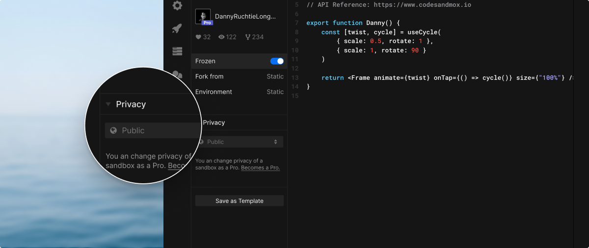
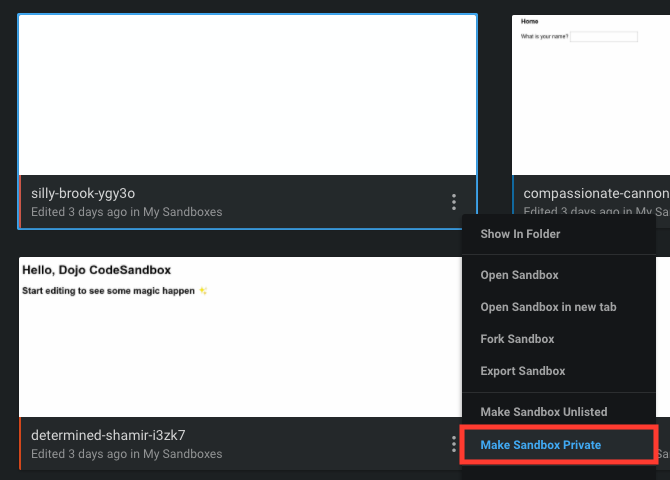

## Which languages and frameworks are supported?

CodeSandbox works with JavaScript (including TypeScript) and has front-end and full-stack support.

We've client templates for: React, Vue, Angular, Preact, Svelte, Dojo, CX, Reason, as well as vanilla JavaScript that uses Parcel, and one for static (HTML, JavaScript, CSS) projects.

We also have container templates for: Node.js, Angular, Adonis, Gatsby, Marko, Nuxt, Next, Sapper, Apollo, Ember, Nest, Styleguidist, MDX Deck, Gridsome, Quasar, and Vuepress.

[Create a sandbox from a template](https://codesandbox.io/s/), or read more about the [difference between client and container sandboxes](/docs/environment).

## How do I make a sandbox private?

You can set a sandbox as private in two main ways: From the editor, change the privacy setting from the Privacy drop-down under Sandbox Info, and from the dashboard right-click and select make private.

Note that a [Pro subscription](https://codesandbox.io/pricing) is required to make sandboxes private or unlisted.

## I'm getting a 422 error when importing from GitHub, why?

There are a few possible reasons a repo might throw that error on import. The most common are either a lack of a `package.json` file, or the project and its dependencies using more than 500 modules. If you think it's something else, or you're not able to solve this yourself, then [get in touch](mailto:hello@codesandbox.io) and provide a link to the repo you're importing and we can look into this for you.

## Why are my start scripts not having an effect?      

For performance reasons we ignore any specified scripts in client sandboxes, instead using a default script. If you need to control the scripts, then we recommend using a container sandbox.

## Can I change the Node version used in a container sandbox?

Container sandboxes run Node v10.18.1 by default. While this system version can't be changed, you can instead make use of the [node](https://www.npmjs.com/package/node) package. Add the version of the node package you would like to use to your sandbox in the same way you would any other package. Since npm runs scripts with the local `./node_modules/.bin` in the `PATH` ahead of the system copy, this means you can use this local version of node instead of the system version.

## Can I open the terminal / console / test panel instead of the browser in a sandbox?

Yes, the terminal, console, and problems tabs are all draggable. Click on the tab and drag it up into the bar alongside browser and tests. You can then re-order those items by dragging them in that bar. Whichever is 1st from left to right in the list of tabs is what opens first when other folks view the sandbox. The ordering is maintained within the sandbox. You can also achieve this change by setting a value for "view" in a [sandbox config file](/docs/configuration#sandbox-configuration). 

## Are there any limitations with sandboxes?

- A sandbox cannot use more than 500 modules (files). This includes dependencies and peer dependencies.
- Imported sandboxes must contain a package.json file.
- The maximum file size that can be opened in the editor is 2MB. Files uploaded that are larger than that still exist but are linked as a static asset.
- The maximum file upload size is 7MB. If you need this raised, please [email us](mailto:hello@codesandbox.io) with your username and the typical type and size of files you want to upload.
- In container sandboxes, there is a sync limit of 10 files per second and only files up to 2MB are synced with the editor. Files larger than that still exist but are not shown in the editor's file tree. You're still able to write and read to and from them in your code code and they can be seen and edited via the terminal.
- Terminal commands which alter the filesystem of the container instance aren't synced with files shown in the editor. You'll need to refresh to see files updated this way.
- Container sandboxes sleep after around 10 minutes and can be woken by opening the sandbox or preview in a web browser.

## I'm getting a 'Request Entity too Large' error, what should I do?

If you encounter this error when importing or committing, check your sandbox or repo for large binary files and remove them.

## Can I use a database on CodeSandbox?

Yes. Container sandboxes on CodeSandbox have a persistent filesystem, so you're able to use file-based database options like [SQLite](https://codesandbox.io/s/sqlite3-sequelize-example-starter-lst3n), [Lowdb](https://codesandbox.io/s/lowdb-json-file-database-example-starter-pldy5), and [NeDB](https://codesandbox.io/s/nedb-example-starter-kyv7s). For more powerful databases, like MongoDB, MySQL etc. we recommend using a third-party host, like [MongoDB Atlas](https://codesandbox.io/s/mongodb-database-example-starter-v3ker), and interacting with them via an API/SDK.

## How do I change the editor theme?

You can change the theme from File > Preferences > Color Theme in the editor.

You can also set a custom VS Code theme. Open VS Code, Press (CMD or CTRL) + SHIFT + P, Enter: '> Developer: Generate Color Scheme From Current Settings', copy the contents and paste it into Preferences > Appearance from the top-right avatar menu. After completing that you need to reload the browser and select "Custom" as your color theme from File > Preferences > Color Theme.

## How do I cancel my Pro/Patron plan?

For Pro users, you can cancel your subscription on the [Pro page](https://codesandbox.io/pro).
For legacy Patron users, you can cancel your subscription on the [Patron page](https://codesandbox.io/patron). 
