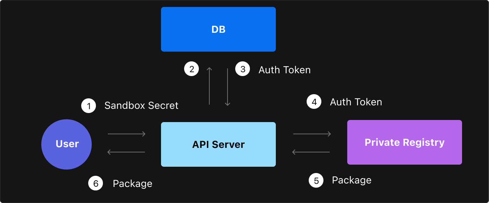

**Note: Custom NPM Registry support is currently only available to Team Pro
pilot members.
[Sign up to join the waitlist](https://airtable.com/shrlgLSJWiX8rYqyG).**

The custom private npm registry setting makes it possible for sandboxes in your
workspace to retrieve npm packages from your own npm registry. This setting is
available for all Team Pro workspaces, you can access the settings
[here](https://codesandbox.io/dashboard/settings/npm-registry).

## Configuration

You can configure your private npm registry in your
[Workspace Settings](https://codesandbox.io/dashboard/settings/npm-registry).

### Registry Host

This can be either GitHub, npm or Custom. When choosing GitHub, we'll prefill
the registry host with the GitHub Registry. When choosing npm, we'll prefill the
host with the npm registry url. When choosing `Custom` you have the option to
define the npm registry host yourself.

### Auth Token

This is the token that we'll use to connect to your registry. This token is
encrypted and stored in our database using an external key, we also don't share
this key with anyone else who has access to your sandbox. Read more about that
[here](#security).

### Specific Scopes

We only use your private registry for the packages that are behind specified
scopes. For example, if you defined `@acme` as an enabled scope, we only use the
registry to fetch packages that have this scope (like `@acme/design-system`).
For all other packages we'll use the public registry.

## Security

It's important to us to keep the information and tokens of the npm registry
private, because of this we've added some extra measures to ensure that nothing
can leak.

### Persisting Auth Token

The auth token is stored in our database in an encrypted form, using a key
that's rolled and not available to the database itself. Even if our database
would be compromised, your auth token would be encrypted and inaccessible.

### Single-Sandbox Key

We never send the auth token to the browser. Instead, we give every editor of
the sandbox a key that only gives them access to that specific sandbox. If they
want to retrieve a package from the private npm registry, they will have to ask
our API. The API will fetch the auth token, request the npm registry on behalf
of the user and return the response to the user.

The advantage of this approach is that whenever you revoke access to an editor
of the sandbox, they also won't have access to your private npm registry
anymore. There's no need to re-roll tokens, as tokens are generated based on a
sandbox-user combination.

## Common Questions

### Can I share a public sandbox with a private package?

No, we only enable private registries on sandboxes that are **private**. The
main reason for this lies in the fact that we execute most sandboxes in the
browser. Because of this, we need to download the npm dependencies to the
browser to execute your code. If you would share a public sandbox containing a
private package with someone, they would need to download that private package
to execute the sandbox. Someone savvy enough would be able to extract the files
from memory and read your private package in that case.

We want to prevent this from accidentally happening, which is why we only allow
private sandboxes to have access to the private registry. If you do want to
share a public sandbox containing a private package, you can add the `.tgz` to
the sandbox and link to it from the `package.json` by referring to it as
`file:/package-tar-name.tgz` in the version field.

### Our npm registry is behind a VPN, what can I do?

Since we use a proxy to access the npm registry, we don't support registries
behind a VPN out of the box. However, we do have three solutions:

**Solution 1: bypass the proxy** We can bypass the proxy on our service to let
the browser fetch from the registry directly. This is not enabled by default for
everyone - please [request this be turned on](mailto:hello@codesandbox.io). The
disadvantage of this approach is that you have to share your registry auth token
with everyone who has access to the sandbox. Also, to make this work, you need
to add CORS headers to your registry so the browser can fetch the packages
directly from our origin.

**Solution 2: whitelist the proxy** Another solution is to whitelist the IP
range of our proxy. We make sure that we keep the same IP for our proxy. Please
[request these details](mailto:hello@codesandbox.io).

**Solution 3: self-host the proxy** A third option is to self-host the proxy in
your network, and letting the proxy communicate with our API server to validate
the tokens that are sent in. We can
[help get you setup with this](mailto:hello@codesandbox.io).

### Can I use a .npmrc file?

If you have a `.npmrc` in your sandbox, and the sandbox belongs to a Pro
Workspace, we'll use the credentials in the `.npmrc` to fetch packages. However,
we discourage this approach, since you'd share your registry auth token with
anyone visiting the sandbox. Using the Workspace Setting ensures that any
collaborator of a sandbox can use the private registry without getting access to
the token.

### Does this work with container sandboxes?

Container Sandboxes are sandboxes that run on a Docker container instead of the
browser. We're still working on adding support for private npm registries in our
container sandboxes. To make private packages work in a container sandbox you
could either drop the `.tgz` file manually in the sandbox, or use a `.npmrc`.
