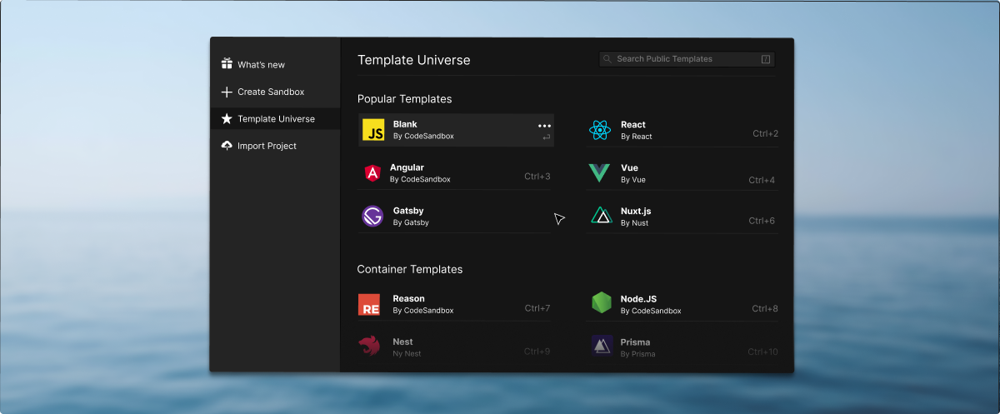

## Create Wizard

The most popular way of creating a new sandbox is the Create Wizard.



The Create Wizard shows you all public templates that are currently available, and takes you to the sandbox that corresponds to the template. You can edit and fork this sandbox to continue with the template.

## Import from GitHub

You can import a GitHub repository in CodeSandbox by going to the [import wizard](https://codesandbox.io/s/github) and giving the URL to your GitHub repository. Note that we just take the last part of the url (everything after github.com) and paste it after codesandbox.io/s/github/. We support custom branches and subdirectories as well. Here is an example URL: [https://codesandbox.io/s/github/reactjs/redux/tree/master/examples/todomvc](https://codesandbox.io/s/github/reactjs/redux/tree/master/examples/todomvc).

The imported repository will always stay up to date with your latest commits. This means that any change to the GitHub repository will be reflected immediately to the sandbox.

### Setting inference

We infer sandbox settings based on several files in a repository.

| Sandbox Setting             | Inferred from                                                                  |
| --------------------------- | ------------------------------------------------------------------------------ |
| Title                       | `name` field in `package.json`                                                 |
| Description                 | `description` field in `package.json`                                          |
| Tags                        | `keywords` field in `package.json`                                             |
| Dependencies                | `dependencies` and `devDependencies` fields in `package.json`                  |
| Entry file                  | `main` field in `package.json`. Otherwise defaults to default template setting |
| Template - Vue              | If there are `.vue` files.                                                     |
| Template - Preact           | If `package.json` dependencies contains `preact-cli`.                          |
| Template - React            | If `package.json` dependencies contains `react-scripts`.                       |
| Template - React-Typescript | If `package.json` dependencies contains `react-scripts-ts`.                    |
| Template - Svelte           | If `package.json` dependencies contains `svelte`.                              |

### Source

You can find the source of our git extractor [here](https://github.com/codesandbox-app/git-extractor).

## Export with CLI

You can export a local project to CodeSandbox by using our [CLI](https://github.com/codesandbox-app/cli).

You can install our CLI by running `npm install -g codesandbox`. Then you can export a project by running `codesandbox {directory}`.

_Note: Our CLI is not updated yet and only supports `create-react-app` projects at this moment_

### Example usage

```
$ npm install -g codesandbox
$ codesandbox ./
```

## Define API

Documentation often wants to be able to dynamically create a sandbox based on its code examples. We have a separate API endpoint for that. You can call this endpoint with a `GET` and with a `POST` request.

Example implementation:

<iframe src="https://codesandbox.io/embed/qzlp7nw34q?editorsize=70&fontsize=14" style="width:100%; height:500px; border:0; border-radius: 4px; overflow:hidden;" sandbox="allow-modals allow-forms allow-popups allow-scripts allow-same-origin"></iframe>

You can define a sandbox by creating a JSON file with
