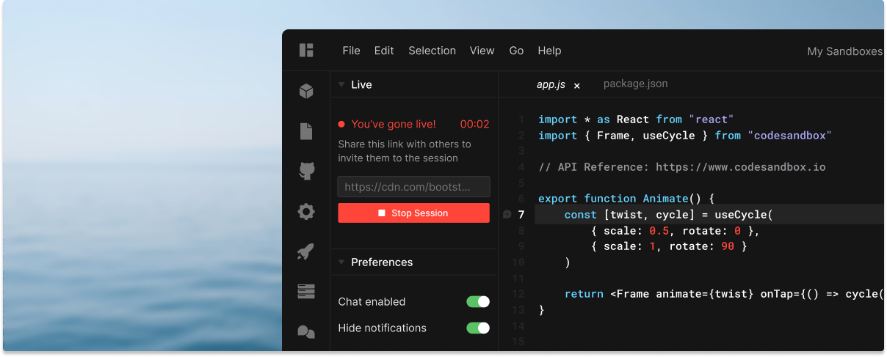

## Creating a Team

You can create and manage teams from the dashboard.

As soon as you've created a team you will be shown the team overview.

## Inviting Team Members

There's no limit on how many team members a team can have. You can invite others
by entering their username in the bottom left corner. They will get a
notification (the bell icon in the header) in CodeSandbox when they are invited to a new team.
From there they can accept or refuse the invitation.

## Sharing Sandboxes

On the dashboard, a team has a sidebar item called "Our Sandboxes" with directories, just
like your personal sandboxes. You can create new sandboxes directly from here,
or drag your own sandboxes from 'My Sandboxes' to 'Our Sandboxes'. All
sandboxes in a team can be seen and edited by all team members. We keep
track of who originally created the sandbox though, and only the
original creator of the sandbox can delete it.

## Collaborating on Sandboxes

Whenever you open a team sandbox, you also automatically open a live session.
Other team members will join this live session if they open the sandbox as well.
You can still invite other people who aren't members of the team to the live session.

