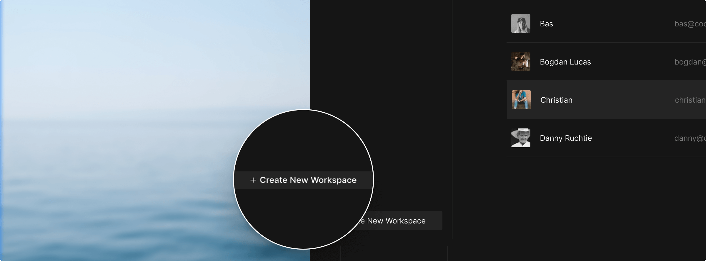
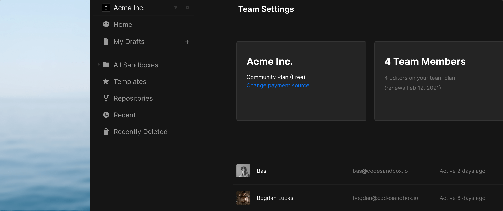

## Creating a Workspace

You can create and manage workspaces from the dashboard.

As soon as you've created a workspace, you will be shown the team overview.

## Inviting People to a Workspace

There's no limit on how many members a workspace can have. You can invite others
by entering their username or email address and selecting 'Add Member.' They will get a 
notification (the bell icon in the header) in CodeSandbox and email when invited
to a new workspace. From there, they can accept or decline the invitation.

## Sharing Sandboxes

You can choose which workspace you're in from the workspace drop-down at the top-left on the 
dashboard. You can create new sandboxes directly from here or from a different workspace, 
select one or more sandboxes, right-click and select 'Move to Folder', where you can choose 
the workspace and folder you want to move them into. All sandboxes in a workspace can be seen 
and edited by all team members. We keep track of who created the sandbox, though, and only the 
the original creator of the sandbox can delete it.

## Collaborating on Sandboxes

You and other members can open a sandbox at the same time and see each other's cursor to work 
together. You can still invite other people who aren't members of the team to the sandbox or 
[live session](/docs/live).
