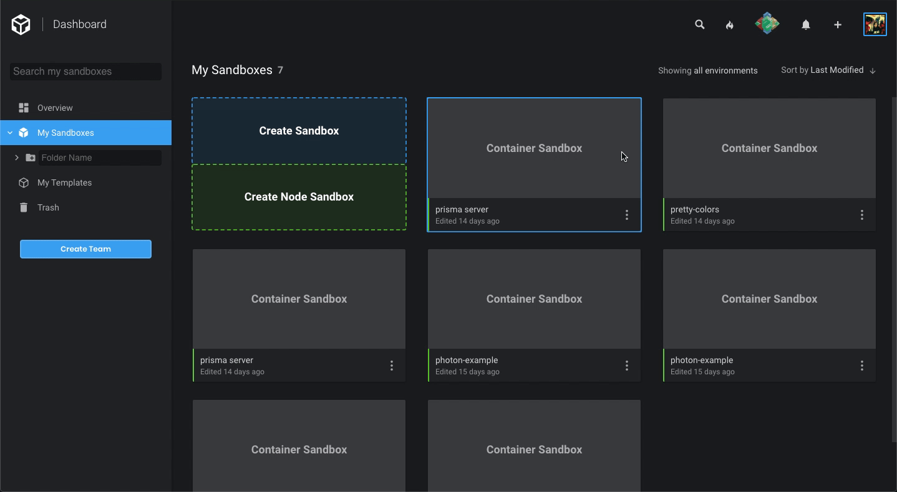
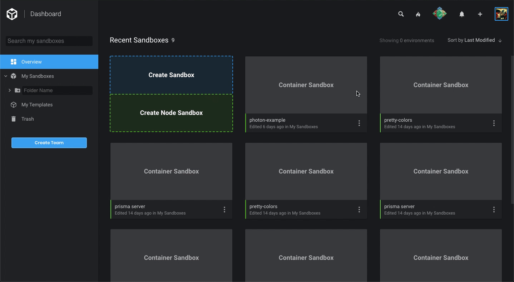
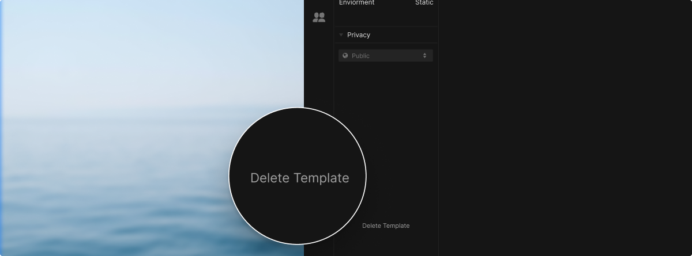

## What are Templates?

Templates are project starting points. They're already setup with the
configuration, file structure, and dependencies installed, so you don't have to
spend time doing this each time you begin working on something new. Templates
are easily accessible from your dashboard and the "Create New Sandbox" modal.

CodeSandbox has a number of official templates, such as React, Vue, Angular,
Gatsby, and others that you can use to quickly start a new project.

You can also create your own custom templates. Turn any sandbox into a template
that's customized for your particular use-case and preferences. Once a custom
template has been created, you can then start new projects from the "Create New
Sandbox" modal using one of your templates. Custom templates can also be added
to teams, so team members can make use of them.

## How to make a custom template

There are a few ways to make a template, but the main way is from within the
"Sandbox Info" panel inside the editor. When viewing one of your sandboxes,
you'll see a button at the bottom of the "Sandbox Info" panel that says
`Save as template`. Clicking this will convert the sandbox to a template, which
will freeze it and make it available from the "Create New Sandbox" modal.

Optionally, from the dashboard, you can either drag and drop a sandbox from
"Overview" or one of your folders under "My Sandboxes" to the new "My Templates"
folder. There is also an option within the sandbox options menu to
`Make Sandbox a Template`.

## Using Templates

After you've made your first custom template, there's a few places from which
you can access and use them. First, inside of the "Create New Sandbox" modal,
you will see a list of your templates under `My Templates`. Clicking on one of
these will fork the template and open it in the editor.

You can also find all of your templates under the `Templates` folder within the
Dashboard. Clicking on any of the templates shown inside this folder will open
it in the editor.

## Editing Templates

Templates are frozen upon creation, preventing you from accidentally making
changes to it. In order to make changes to a template, unfreeze it from the
"Sandbox Info" panel. Any time you try to make a change to a frozen template, a
modal will prompt you to fork the template or unfreeze it for the current
session.

Any changes you make to an unfrozen Template are saved immediately. You don't
need to freeze it again as it is automatically frozen again when you navigate
away from the editor or finish the current sandbox session.

## Deleting Templates

There are a few ways in which you can "delete" a template. From the "Sandbox
Info" panel inside the editor, there is a `Delete Template` button at the bottom
when viewing an existing template. Clicking this will convert the template back
to a regular sandbox, removing it from the "Create New Sandbox" modal and moving
back to the "Overview" and "My Sandboxes" folders inside the dashboard.

Alternatively, you can use a template's options menu inside the "My Templates"
folder to select `Convert to Sandbox`.

